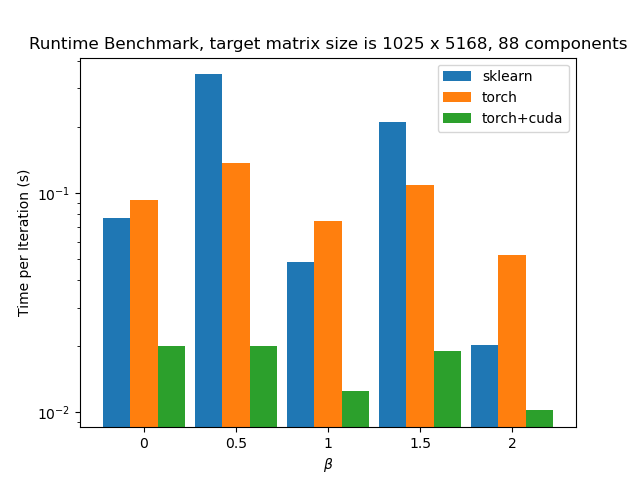

# Non-negative Matrix Fatorization in PyTorch

[](https://github.com/yoyololicon/pytorch-NMF/actions/workflows/python-package.yml)
[](https://github.com/yoyololicon/pytorch-NMF/actions/workflows/python-publish.yml)
[](https://codecov.io/gh/yoyololicon/pytorch-NMF)
[](https://pytorch-nmf.readthedocs.io/en/latest/?badge=latest)
[](https://badge.fury.io/py/torchnmf)

PyTorch is not only a good deep learning framework, but also a fast tool when it comes to matrix operations and convolutions on large data.
A great example is [PyTorchWavelets](http://github.com/tomrunia/PyTorchWavelets).


In this package I implement NMF, PLCA and their deconvolutional variations in PyTorch based on `torch.nn.Module`, 
so the models can be moved freely among CPU/GPU devices and utilize parallel computation of cuda.
We also utilize the computational graph from `torch.autograd` to derive updated coefficients so the amount of codes is reduced and easy to maintain.

# Modules

## NMF

Basic NMF and NMFD module minimizing beta-divergence using multiplicative update rules.


The interface is similar to `sklearn.decomposition.NMF` with some extra options.

* `NMF`: Original NMF algorithm.
* `NMFD`: 1-D deconvolutional NMF algorithm.
* `NMF2D`: 2-D deconvolutional NMF algorithm. 
* `NMF3D`: 3-D deconvolutional NMF algorithm. 

## PLCA

Basic PLCA and SIPLCA module using EM algorithm to minimize
KL-divergence between the target distribution and the estimated
distribution.

* `PLCA`: Original PLCA (Probabilistic Latent Component Analysis)
  algorithm.
* `SIPLCA`: Shift-Invariant PLCA algorithm (similar to NMFD).
* `SIPLCA2`: 2-D deconvolutional SIPLCA algorithm.
* `SIPLCA3`: 3-D deconvolutional SIPLCA algorithm.


## Usage

Here is a short example of decompose a spectrogram using deconvolutional NMF:

```python
import torch
import librosa
from torchnmf.nmf import NMFD
from torchnmf.metrics import kl_div

y, sr = librosa.load(librosa.util.example_audio_file())
y = torch.from_numpy(y)
windowsize = 2048
S = torch.stft(y, windowsize, 
               window=torch.hann_window(windowsize),
               return_complex=True).abs().cuda()
S = S.unsqueeze(0)

R = 8   # number of components
T = 400 # size of convolution window

net = NMFD(S.shape, rank=R, T=T).cuda()
# run extremely fast on gpu
net.fit(S)      # fit to target matrix S
V = net()
print(kl_div(V, S))        # KL divergence to S
```
A more detailed version can be found [here](examples/librosa_example.py). 
See our [documentation](https://pytorch-nmf.readthedocs.io/en/latest/) to find out more usage of this package.


## Compare to sklearn

The barchart shows the time cost per iteration with different
beta-divergence. It shows that pytorch-based NMF has a much more constant process time across 
different beta values, which can take advantage when beta is not 0, 1, or 2.
This is because our implementation use the same computational graph regardless which beta-divergence are we minimizing.
It runs even faster when computation is done on GPU. The test is conducted on a
Acer E5 laptop with i5-7200U CPU and GTX 950M GPU.

 

## Installation

```
pip install torchnmf
```

## Requirements

* PyTorch
* tqdm

## Tips

* If you notice significant slow down when operating on CPU, please flush denormal numbers by `
torch.set_flush_denormal(True)`.


## TODO

- [x] Support sparse matrix target (only on `NMF` module).
- [x] Regularization.
- [ ] NNDSVD initialization.
- [x] 2/3-D deconvolutional module.
- [x] PLCA.
- [x] Documentation.
- [ ] ipynb examples.
- [x] Refactor PLCA module.
